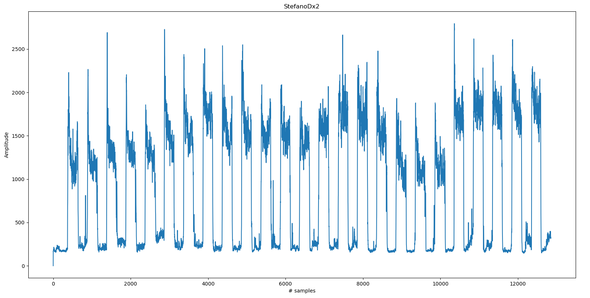
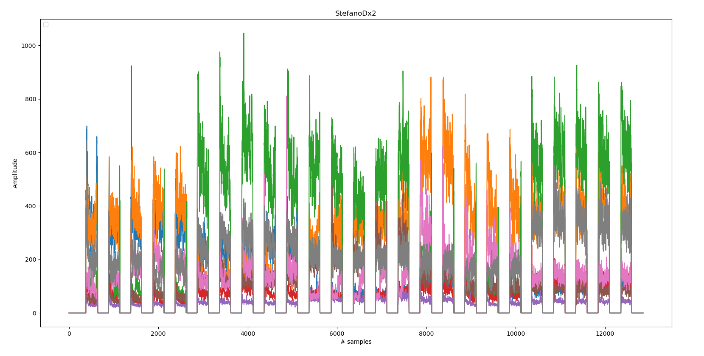

# Overview

This project provides multiple Python scripts to:

- Collect EMG data from a Myo armband
- Preprocess EMG data and create a dataset of EMG image, according to the method described in the paper [On the Use of Deeper CNNs in Hand Gesture Recognition Based on sEMG Signals](https://ieeexplore.ieee.org/abstract/document/8900709). A related GitHub repository is available at: [MyoUP_dataset](https://github.com/tsagkas/MyoUP_dataset).
- Train an ANN based on the created dataset, the structure of the ANN is a CNN with a custom architecture, similar to the one defined in the previous repository.
- Test the CNN and the classifier in a real time application.


# Requirements
To run all the scrpits properly, please make sure to install the following packages/libraries:

- Python2 (suggested 2.7) and Python3 (suggested 3.6)
- ROS package for Myo Armband, available from **uts-magic-lab** repository: [ros_myo](https://github.com/uts-magic-lab/ros_myo)

For the following libraries I strongly suggest to install [Anaconda](https://docs.anaconda.com/anaconda/install/linux/) and manage packages and versions with [Anaconda-Navigator](https://docs.anaconda.com/anaconda/navigator/)) :

- Numpy (>1.15)
- Matplotlib (>2.2.3)
- tensorflow & tensorflow-gpu (1.14)
- keras & keras-gpu (2.3.1) 
- NVIDIA software for GPU hardware acceleration, this include:
	- Driver GPU NVIDIA (tested with NVIDIA driver 450 and CUDA 11.0)
	- CUDA Toolkit (10.0.130)
	- cudNN (7.6.5)
	
For support during installation of NVIDIA drivers/libraries, take a look at: https://www.tensorflow.org/install/gpu, especially in the section "Requirements"
If not preinstalled in your Anaconda enviroment, install also:

- scikit-learn (0.19.1) and scipy (1.1.0)


#Dongle Myo Armband
To read data from Myo armband proceed as follow:
Allow USB permission for you user with, typing in a terminal:
```
sudo chown USER_NAME ttyACM0
```
*ttyACM0* should be the default port of your Myo Armband. If different, please replace *ttyACM0* with the name of the port connected with the bluetooth receiver.

Then, test you connection using the **ros_myo** package launch file:
```
roslaunch ros_myo myo.launch
```
All necessary topics will be published. Details of the topics are available at **uts-magic-lab** repository specified in the requiremets.

#Collect and Preprocess Data
To collect data, save all EMG data in a bag file from topic */myo_raw/myo_emg*:
```
rosbag record /myo_raw/myo_emg
```
Each subject must follow the recording rules described in [MyoUP_dataset](https://github.com/tsagkas/MyoUP_dataset). In details:

- 5 gestures
- Each gesture repeated 5 times
- Keep gesture for 5 seconds, rest for 5 seconds

In this way, the total acqusition time for one subject should be around 250s.

##preprocessing_analysis.py
This script must be executed as first, it plots the **sum** of each EMG channel along the entire acquisition of one subject. It helps to visualize data for the next script.
##analyze_subjects.py
This script filters data in order to put at value 0 all the EMG values for the rest phases in gestures acqusition. This helps to have 25 (5x5) clean pattern of gesture, well separeted, for a single subject acquisition. However, the trehsholds to filter at 0 are specified manually, by adding specific lines of code in *analyze_subjects.py*. To help with this, proceed as follow:

- check in the plots the values of the EMG channel **sum**
- decide limit thresholds: everything below a specific value will be put equal to 0.

For instance, consider the sum of EMG signals for one subject: 
To remove the noise in the rest phases, add in the code the following lines (aka. "filters"):
```
#Subject 4
    subj.append(Subject("StefanoDx2", "src/Dataset/5_Gest2_Ste_Dx2/5_Gest2_Ste_Dx2.bag"))
    filters.append((
        Filter(850, [0, 1637]),
        Filter(1112, [1637, 1670]),
        Filter(850, [1670, 5445]),
        Filter(1027, [5045, 8514]),
        Filter(720, [8514, -1])
    ))
```
This is equal to 5 filters. Consdider the first filter: everything between samples [0,1637] whose values are below 850 are put to 0. Repeat for every acquisition sample range  desired.

The final results (with all 8 EMG channels displayed) is:


You can add as many subjects you want, but be carefull to follow the acquisition rules specified previously. If everything is done correctly, some **dataset** files with *train, validation and test* data are automatically generated in **myo_recognition/src/Dataset**. This will be used in the next script to train your CNN.

#Training CNN
The network architecture is totally based on [MyoUP_dataset](https://github.com/tsagkas/MyoUP_dataset) CNN architectures. Thus, refer to detail in the related paper. Briefly, data from 8 channels are collect 15 times, creating a grid of 8x15 samples. Such grid is treated as in image input for the CNN. a 60% image overlap is considered for data augmentation. Once the dataset has been created with previous script you can train your CNN.

##training.py
Run this script for start training and create the classifier, it will be saved in *myo_recognition/src/Models*. If desired, try different hyperparameters and optimizers at lines:
```
# Optimizer
model.compile(loss='categorical_crossentropy',
              optimizer='rmsprop',
              metrics=['accuracy'])

# Fit
model.fit(x = X_train, y = Y_train, validation_data=(X_val, Y_val), epochs = 500, batch_size = 256, verbose = 1, callbacks = [tensorboard])
```
The CNN has been tested with this hyperparameters with good results, classifying 2/3 subjects and related gestures. If necessary, the code also runs **tensorboard** callback for better training visualization. 

# Test Classifier in Real Time
Test your classifier using the following script

##cnn_test.py
A simple ROS node that run at >50Hz rate. It publish values 0-5 depening on the gestured predicted. An input EMG image (8x15) is created from **/myo_raw/myo_emg**, published as 50Hz.
Chose your classifier (previously save in folder *myo_recognition/Models/*) by modify:
```
model_name = "MODEL_NAME"
```

